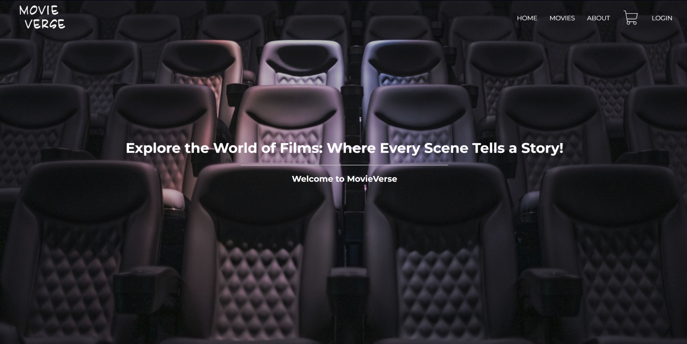

# MovieVerse - Ecommerce Shop

MovieVerse is an online platform where users can browse and purchase movies. It features a user-friendly website for browsing and buying movies. The project is split into two main parts: the Frontend (the user interface) and the Backend (the API for handling movie data and purchases).

## Why? (Motivation / Problem to Solve)

MovieVerse aims to make purchasing movies online easier and more enjoyable. By providing a simple and intuitive platform, MovieVerse ensures that users can find, purchase, and enjoy movies seamlessly, while offering a secure and efficient shopping experience.

## Features

- **User Authentication**: Users can seamlessly log in and log out of their accounts, providing personalized access to movie browsing and purchasing features.
- **Home Page with Popular Movies**: Users are greeted with a curated list of popular movies, showcasing the latest and most-viewed films.
- **Pagination for All Movies**: Browse through a vast collection of movies with easy pagination, allowing users to navigate through large volumes of content effortlessly.
- **Filter by Price (High to Low)**: Users can filter movies based on their price, selecting either the highest to lowest or the lowest to highest prices for an optimized shopping experience.
- **Filter by Movie Genre**: Users can filter movies by genre, allowing them to find movies that suit their tastes, whether it's action, comedy, drama, or more.
- **Movie Detail Page**: Clicking on a movie reveals detailed information, including description, price, rating, and more, so users can make informed decisions before adding them to their cart.
- **Suggested Movies**: After viewing a specific movie, users are shown suggested films based on the same category, helping them discover more movies they'll like.
- **Add and Remove from Cart**: Users can easily add movies to their cart and remove them as needed, providing complete control over their selections.
- **About Page**: A dedicated about page offering information about the platform.
- **Stripe Payment Integration**: Securely purchase movies with Stripe's payment system, offering users a smooth and trusted checkout process.

## Technologies Used

- **Frontend**:

  - **React** - JavaScript library for building user interfaces.
  - **HTML** - Structure of the web application.
  - **CSS** - For styling the website.
  - **JavaScript** - Used for client-side logic and interactivity.

- **Backend**:
  - **Docker** - A containerization platform used to package and deploy the application in lightweight, isolated environments, ensuring consistency across different environments and simplifying the deployment process.
  - **Java** - Programming language used for backend development.
  - **Spring Boot** - Framework for building the backend API and handling HTTP requests.
  - **Spring Data JPA** - Simplifies database interaction by providing an abstraction layer for managing data persistence, making it easier to interact with relational databases.
  - **Spring Security** - Provides authentication and authorization, securing your application by managing user roles and permissions.
  - **Spring Validation** - A framework used for validating input data, ensuring that the data received by the application is correct and meets the defined rules.
  - **MySQL** - Relational database for storing movie, user, and order data.
  - **JWT (JSON Web Tokens)** - For user authentication and secure communication between the frontend and backend.
  - **Stripe** - Payment processing system for handling movie purchases.

## How to Run the Project Locally

### Installation Steps

1. **Clone the repository:**

   ```bash
   git clone https://github.com/LuisSilva7/movieVerse-project.git
   ```

2. **Navigate to the project backend directory:**

   ```bash
   cd movieVerse-project/movieVerse-backend
   ```

3. **Run MySQL container:**

   ```bash
   docker compose up -d
   ```

4. **Install project dependencies:**

   ```bash
   mvn spring-boot:run
   ```

5. **Navigate to the project frontend directory:**

   ```bash
   cd movieVerse-project/movieVerse-frontend
   ```

6. **Install project dependencies:**

   ```bash
   npm install
   ```

7. **Start the development server:**
   ```bash
   npm run dev
   ```

The application will be available at [http://localhost:5000](http://localhost:5000) in your browser.

### Docker Setup (Optional)

If you prefer to run the application inside a Docker container, follow these steps:

1. **Navigate to the project frontend directory:**

   ```bash
   cd movieVerse-project/movieVerse-frontend
   ```

2. **Build the Docker frontend image:**

   ```bash
   docker build -t movieverse-frontend-project -f ../docker/frontend/Dockerfile .
   ```

3. **Navigate to the project backend directory:**

   ```bash
   cd movieVerse-project/movieVerse-backend
   ```

4. **Build the Docker backend image:**

   ```bash
   docker build -t movieverse-backend-project -f ../docker/backend/Dockerfile .
   ```

5. **Run all containers:**

   ```bash
   docker compose -f ../docker/docker-compose.yml up -d
   ```

The application will be available at [http://localhost:5000](http://localhost:5000) in your browser.

## Screenshots

### Home Page



### About Page


### Movies Page


### Movie Page


### Cart Page


### Stripe Page


### Maintainer

- **Luis Silva** (Owner/Developer)
